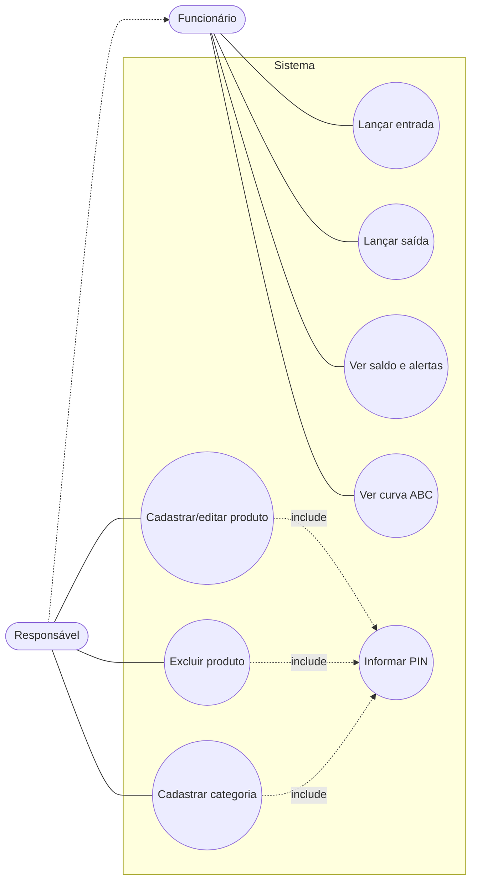
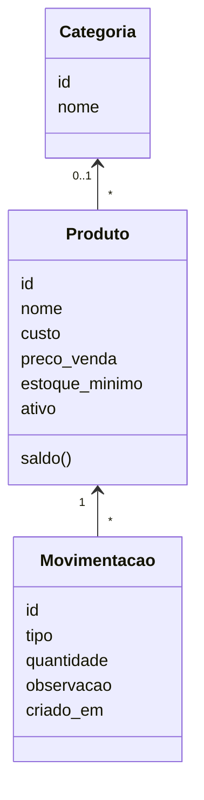

# UML

## Casos de uso

```mermaid
flowchart LR
    F([Funcionário])
    R([Responsável])
    R -.-> F

    subgraph Sistema
        UC1((Lançar entrada))
        UC2((Lançar saída))
        UC3((Ver saldo e alertas))
        UC4((Ver curva ABC))
        UC5((Cadastrar/editar produto))
        UC6((Excluir produto))
        UC7((Cadastrar categoria))
        PIN((Informar PIN))
    end

    F --- UC1 & UC2 & UC3 & UC4
    R --- UC5 & UC6 & UC7
    UC5 -. include .-> PIN
    UC6 -. include .-> PIN
    UC7 -. include .-> PIN
```

## Classes

```mermaid
classDiagram
    class Categoria {
        id
        nome
    }
    class Produto {
        id
        nome
        custo
        preco_venda
        estoque_minimo
        ativo
        saldo()
    }
    class Movimentacao {
        id
        tipo
        quantidade
        observacao
        criado_em
    }
    Categoria "0..1" <-- "*" Produto
    Produto "1" <-- "*" Movimentacao
```

O saldo é calculado pela view `vw_saldos` a partir das movimentações.
